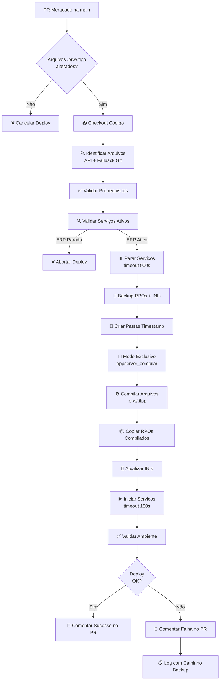

# 🚀 Deploy Automatizado Protheus

Sistema de deploy automatizado para aplicações Protheus/TOTVS via GitHub Actions, com compilação incremental de arquivos `.prw` e `.tlpp`.

## 📋 Índice

- [Visão Geral](#visão-geral)
- [Funcionalidades](#funcionalidades)
- [Arquitetura](#arquitetura)
- [Pré-requisitos](#pré-requisitos)
- [Instalação](#instalação)
- [Configuração](#configuração)
- [Uso](#uso)
- [Fluxo de Deploy](#fluxo-de-deploy)
- [Scripts](#scripts)
- [Troubleshooting](#troubleshooting)
- [Rollback](#rollback)

## 🎯 Visão Geral

Este projeto implementa um pipeline CI/CD completo para deploys de código Protheus em ambiente de produção, executando automaticamente quando Pull Requests são mergeados na branch `main`.

### Principais Características

- ✅ Deploy automático via GitHub Actions
- ✅ Compilação incremental (apenas arquivos alterados)
- ✅ Backup automático antes do deploy
- ✅ Validações de ambiente e serviços
- ✅ Timeouts configuráveis
- ✅ Fallback robusto em caso de falhas
- ✅ Comentários automáticos no PR
- ✅ Logs detalhados
- ✅ Gerenciamento inteligente de serviços

## 🎨 Funcionalidades

### Script Python (`deploy_protheus.py`)

- **Validação de pré-requisitos**: Verifica existência de diretórios, binários e permissões
- **Validação de serviços**: Impede deploy se o ERP já estiver parado
- **Backup automático**: Cria backup de RPOs e INIs antes de cada deploy
- **Compilação incremental**: Compila apenas arquivos modificados
- **Gestão de serviços**: Para, inicia e gerencia modo exclusivo do appserver
- **Limpeza de workspace**: Remove artefatos temporários sem afetar arquivos versionados
- **Timeouts configuráveis**: Evita travamentos em operações longas
- **Fallback SIGTERM/SIGKILL**: Força parada de serviços em caso de timeout
- **Logs estruturados**: Registra todas as operações com timestamp

### Script Bash (`gerenciar_servicos.sh`)

- **Iniciar serviços**: Inicia todos os serviços Protheus com monitoramento
- **Parar serviços**: Para serviços com timeout de 30s e kill -9 em fallback
- **Reiniciar serviços**: Para e reinicia todos os serviços
- **Modo exclusivo**: Inicia apenas appserver_compilar para compilação

### GitHub Actions Workflow

- **Detecção inteligente de arquivos**: API do GitHub + fallback git diff
- **Execução condicional**: Deploy apenas se houver arquivos `.prw`/`.tlpp` alterados
- **Self-hosted runner**: Executa no próprio servidor de produção
- **Comentários no PR**: Feedback automático sobre sucesso/falha do deploy
- **Permissões granulares**: Segurança com princípio do menor privilégio

## 🏗️ Arquitetura

```
┌─────────────────────────────────────────────────────────────┐
│                     GitHub Repository                        │
│  ┌──────────────┐         ┌──────────────┐                 │
│  │   PR Merge   │────────▶│ GitHub Actions│                 │
│  │  (main branch)│         │   Workflow    │                 │
│  └──────────────┘         └───────┬───────┘                 │
└─────────────────────────────────────│──────────────────────┘
                                      │
                                      ▼
┌─────────────────────────────────────────────────────────────┐
│              Self-Hosted Runner (Servidor Produção)          │
│                                                              │
│  ┌──────────────────────────────────────────────────────┐  │
│  │          deploy_protheus.py                           │  │
│  │                                                        │  │
│  │  1. Validar pré-requisitos                            │  │
│  │  2. Atualizar repositório (git pull)                  │  │
│  │  3. Identificar arquivos alterados                    │  │
│  │  4. Validar serviços ativos                           │  │
│  │  5. Parar serviços (gerenciar_servicos.sh parar)     │  │
│  │  6. Fazer backup (RPOs + INIs)                        │  │
│  │  7. Criar pastas timestamp                            │  │
│  │  8. Modo exclusivo (gerenciar_servicos.sh exclusivo) │  │
│  │  9. Compilar arquivos (.prw/.tlpp)                    │  │
│  │  10. Copiar RPOs compilados                           │  │
│  │  11. Atualizar INIs                                   │  │
│  │  12. Iniciar serviços (gerenciar_servicos.sh iniciar)│  │
│  │  13. Validar ambiente                                 │  │
│  └──────────────────────────────────────────────────────┘  │
│                           │                                  │
│                           ▼                                  │
│  ┌──────────────────────────────────────────────────────┐  │
│  │          gerenciar_servicos.sh                        │  │
│  │                                                        │  │
│  │  • iniciar    - Inicia todos os serviços             │  │
│  │  • parar      - Para todos os serviços               │  │
│  │  • reiniciar  - Reinicia todos os serviços           │  │
│  │  • exclusivo  - Modo compilação                      │  │
│  └──────────────────────────────────────────────────────┘  │
│                                                              │
│  ┌──────────────┐  ┌──────────────┐  ┌──────────────┐     │
│  │ AppServer    │  │   RPOs       │  │   Backups    │     │
│  │ (Binários)   │  │ (Ambientes)  │  │  (Histórico) │     │
│  └──────────────┘  └──────────────┘  └──────────────┘     │
└─────────────────────────────────────────────────────────────┘
```

## 📦 Pré-requisitos

### Servidor

- Linux (testado em CentOS/RHEL)
- Python 3.12+
- Git
- Protheus 12 (AppServer)
- Systemd para gerenciamento de serviços
- Sudo configurado (opcional, para operações privilegiadas)

### Estrutura de Diretórios

```
/opt/git_protheus/protheus/          # Repositório Git
  ├── src/                           # Código fonte
  │   ├── faturamento/
  │   ├── producao/
  │   └── solar/
  └── Includes/                      # Arquivos de include (.ch)

/totvs/p12prd/apo/                   # RPOs por ambiente
  ├── producao/
  │   └── YYYYMMDD_HHMM/            # Versões com timestamp
  ├── solar/
  │   └── YYYYMMDD_HHMM/
  ├── faturamento/
  │   └── YYYYMMDD_HHMM/
  ├── compilar/
  │   └── YYYYMMDD_HHMM/
  └── backup_rpo/                    # Backups automáticos
      └── YYYYMMDD_HHMM_backup/

/totvs/p12prd/bin/                   # Binários e INIs
  ├── appserver_compilar/
  │   └── appserver.ini
  ├── appserver_slave_01/
  │   └── appserver.ini
  └── ...

/totvs/scripts/                      # Scripts de automação
  ├── deploy_protheus.py
  └── gerenciar_servicos.sh
```

### Serviços Systemd

Os serviços abaixo são um exemplo e devem estar configurados no systemd:

```
appserver_broker_rest.service
appserver_broker_webapp.service
appserver_portal_01.service
appserver_compilar.service
appserver_slave_01.service até appserver_slave_10.service
```

### GitHub

- GitHub Actions habilitado
- Self-hosted runner configurado no servidor
- Permissões configuradas no repositório

## 🔧 Instalação

### 1. Clonar o Repositório

```bash
cd /opt/git_protheus/
git clone <seu-repositorio> protheus
cd protheus
```

### 2. Copiar Scripts

```bash
# Copiar script de deploy
sudo cp deploy_protheus.py /totvs/scripts/
sudo chmod +x /totvs/scripts/deploy_protheus.py

# Copiar script de gerenciamento de serviços
sudo cp gerenciar_servicos.sh /totvs/scripts/
sudo chmod +x /totvs/scripts/gerenciar_servicos.sh
```

### 3. Configurar Workflow do GitHub Actions

Criar o arquivo `.github/workflows/deploy-production.yml`:

```yaml
name: Deploy Protheus Production

permissions:
  contents: read
  pull-requests: write
  issues: write

on:
  pull_request:
    types: [closed]
    branches: [main]
    paths:
      - '**/*.[Pp][Rr][Ww]'
      - '**/*.[Tt][Ll][Pp][Pp]'

jobs:
  deploy:
    permissions:
      contents: read
      pull-requests: write
      issues: write
    name: Deploy to Production
    runs-on: self-hosted
    if: github.event.pull_request.merged == true

    steps:
      - name: Checkout do código
        uses: actions/checkout@v4
        with:
          fetch-depth: 0

      - name: Verificar arquivos alterados (API)
        id: cf_api
        uses: actions/github-script@v7
        with:
          script: |
            const pr = context.payload.pull_request;
            const owner = context.repo.owner;
            const repo  = context.repo.repo;

            let files = [];
            let page = 1;
            while (true) {
              const res = await github.rest.pulls.listFiles({
                owner, repo, pull_number: pr.number, per_page: 100, page
              });
              if (res.data.length === 0) break;
              for (const f of res.data) files.push(f.filename);
              if (res.data.length < 100) break;
              page++;
            }

            files = [...new Set(files)].filter(n => /\.(prw|tlpp)$/i.test(n));

            core.info('Arquivos (API):\n' + (files.map(f => '  - ' + f).join('\n') || '  (nenhum)'));
            core.setOutput('changed_files', files.join('\n'));
            core.setOutput('has_changes', files.length ? 'true' : 'false');

      - name: Verificar arquivos alterados (fallback git)
        id: cf_git
        if: steps.cf_api.outputs.has_changes != 'true'
        shell: bash
        run: |
          echo "🔎 Fallback git..."
          BASE_SHA="${{ github.event.pull_request.base.sha }}"
          HEAD_SHA="${{ github.sha }}"
          LIST="$(git diff --name-only "$BASE_SHA" "$HEAD_SHA" | grep -Ei '\.(prw|tlpp)$' | sort -u || true)"
          if [ -z "$LIST" ]; then
            echo "Fallback secundário: HEAD~1..HEAD"
            LIST="$(git diff --name-only HEAD~1 HEAD | grep -Ei '\.(prw|tlpp)$' | sort -u || true)"
          fi
          echo "Arquivos (git):"
          echo "${LIST}" | sed 's/^/  - /' || true

          {
            echo "changed_files<<EOF"
            echo "${LIST}"
            echo "EOF"
          } >> "$GITHUB_OUTPUT"

          if [ -z "$LIST" ]; then
            echo "has_changes=false" >> "$GITHUB_OUTPUT"
          else
            echo "has_changes=true" >> "$GITHUB_OUTPUT"
          fi

      - name: Consolidar lista de arquivos
        id: cf
        shell: bash
        run: |
          if [ "${{ steps.cf_api.outputs.has_changes }}" = "true" ]; then
            SRC="API"
            FILES="${{ steps.cf_api.outputs.changed_files }}"
          else
            SRC="git"
            FILES="${{ steps.cf_git.outputs.changed_files }}"
          fi

          echo "Fonte escolhida: $SRC"
          echo "Arquivos finais:"
          echo "$FILES" | sed 's/^/  - /' || true

          {
            echo "changed_files<<EOF"
            echo "$FILES"
            echo "EOF"
          } >> "$GITHUB_OUTPUT"

          if [ -z "$FILES" ]; then
            echo "has_changes=false" >> "$GITHUB_OUTPUT"
          else
            echo "has_changes=true" >> "$GITHUB_OUTPUT"
          fi

      - name: Executar Deploy
        if: steps.cf.outputs.has_changes == 'true'
        env:
          SUDO: "sudo -n"
          TIMEOUT_PARAR: "900"
          TIMEOUT_INICIAR: "180"
          TIMEOUT_EXCLUSIVO: "120"
          CHANGED_FILES: ${{ steps.cf.outputs.changed_files }}
        shell: bash
        run: |
          echo "🚀 Iniciando deploy do Protheus..."
          echo "Arquivos que serão deployados:"
          echo "${CHANGED_FILES}" | while read -r file; do
            [ -n "$file" ] && echo "  - $file"
          done

          if [ ! -f "/totvs/scripts/deploy_protheus.py" ]; then
            echo "❌ Script de deploy não encontrado em /totvs/scripts/deploy_protheus.py"
            exit 1
          fi

          set -o pipefail
          python3.12 /totvs/scripts/deploy_protheus.py 2>&1 | tee deploy_output.log
          rc=${PIPESTATUS[0]}
          if [ $rc -eq 0 ]; then
            echo "✅ Deploy executado com sucesso!"
          else
            echo "❌ Deploy falhou! (rc=$rc)"
            echo "=== ÚLTIMAS LINHAS DO LOG ==="
            tail -50 deploy_output.log || true
            exit 1
          fi

      - name: Exibir informações se não há arquivos para deploy
        if: steps.cf.outputs.has_changes == 'false'
        run: |
          echo "ℹ️  Nenhum arquivo .prw/.tlpp foi alterado neste PR."
          echo "Deploy cancelado automaticamente."

      - name: Comentar resultado no PR
        if: always() && github.event.pull_request
        uses: actions/github-script@v7
        with:
          script: |
            const ok = "${{ job.status }}" === "success";
            const ts = new Date().toLocaleString('pt-BR');
            const body = ok
              ? `## ✅ Deploy realizado com sucesso!\n\n**Timestamp:** ${ts}\n**Status:** Concluído com sucesso\n\nO deploy foi executado automaticamente após o merge do PR.`
              : `## ❌ Deploy falhou!\n\n**Timestamp:** ${ts}\n**Status:** Falhou durante execução\n\nVerifique os logs da execução e considere rollback se necessário.`;
            github.rest.issues.createComment({
              issue_number: context.payload.pull_request.number,
              owner: context.repo.owner,
              repo: context.repo.repo,
              body
            })
```

### 4. Configurar Self-Hosted Runner

```bash
# No servidor, seguir documentação oficial do GitHub:
# https://docs.github.com/pt/actions/hosting-your-own-runners

# Exemplo de instalação:
mkdir actions-runner && cd actions-runner
curl -o actions-runner-linux-x64-2.311.0.tar.gz -L https://github.com/actions/runner/releases/download/v2.311.0/actions-runner-linux-x64-2.311.0.tar.gz
tar xzf ./actions-runner-linux-x64-2.311.0.tar.gz
./config.sh --url https://github.com/seu-usuario/seu-repo --token SEU_TOKEN
sudo ./svc.sh install
sudo ./svc.sh start
```

### 5. Configurar Permissões Sudo (Opcional)

Para permitir operações privilegiadas sem senha:

```bash
# Criar arquivo /etc/sudoers.d/github-runner
sudo visudo -f /etc/sudoers.d/github-runner

# Adicionar:
github-runner ALL=(ALL) NOPASSWD: /usr/bin/systemctl
github-runner ALL=(ALL) NOPASSWD: /usr/bin/pkill
github-runner ALL=(ALL) NOPASSWD: /usr/bin/kill
```

## ⚙️ Configuração

### Variáveis de Ambiente

O script `deploy_protheus.py` aceita as seguintes variáveis de ambiente:

| Variável | Padrão | Descrição |
|----------|--------|-----------|
| `SUDO` | `""` | Comando sudo para operações privilegiadas (ex: `"sudo -n"`) |
| `TIMEOUT_PARAR` | `900` | Timeout em segundos para parar serviços (15 min) |
| `TIMEOUT_INICIAR` | `180` | Timeout em segundos para iniciar serviços (3 min) |
| `TIMEOUT_EXCLUSIVO` | `120` | Timeout em segundos para modo exclusivo (2 min) |
| `CHANGED_FILES` | `""` | Lista de arquivos alterados (preenchido automaticamente) |

### Configuração no Workflow

As variáveis são configuradas no workflow do GitHub Actions:

```yaml
env:
  SUDO: "sudo -n"
  TIMEOUT_PARAR: "900"
  TIMEOUT_INICIAR: "180"
  TIMEOUT_EXCLUSIVO: "120"
```

Ajuste os valores conforme a necessidade do seu ambiente.

## 🚀 Uso

### Deploy Automático via GitHub Actions

1. **Criar uma branch a partir de main:**
   ```bash
   git checkout main
   git pull
   git checkout -b feature/nova-funcionalidade
   ```

2. **Fazer alterações nos arquivos `.prw` ou `.tlpp`:**
   ```bash
   # Editar arquivos
   vim src/faturamento/FATA001.prw
   ```

3. **Commit e push:**
   ```bash
   git add .
   git commit -m "feat: implementa nova funcionalidade X"
   git push origin feature/nova-funcionalidade
   ```

4. **Criar Pull Request para `main`**

5. **Após aprovação e merge, o deploy é executado automaticamente! 🎉**

### Deploy Manual via Python

```bash
# No servidor de produção
cd /opt/git_protheus/protheus

# Executar deploy manualmente
python3.12 /totvs/scripts/deploy_protheus.py
```

### Gerenciamento Manual de Serviços

```bash
# Iniciar todos os serviços
bash /totvs/scripts/gerenciar_servicos.sh iniciar

# Parar todos os serviços
bash /totvs/scripts/gerenciar_servicos.sh parar

# Reiniciar todos os serviços
bash /totvs/scripts/gerenciar_servicos.sh reiniciar

# Modo exclusivo (apenas appserver_compilar)
bash /totvs/scripts/gerenciar_servicos.sh exclusivo
```

## 🔄 Fluxo de Deploy



## 📜 Scripts

### deploy_protheus.py

Script principal de deploy em Python 3.12. Executa todas as etapas do deploy de forma automatizada.

**Principais funções:**

- `verificar_prerequisitos()` - Valida estrutura de diretórios e permissões
- `validar_servicos_ativos_antes_do_deploy()` - Impede deploy se ERP estiver parado
- `atualizar_repositorio()` - Faz git pull e limpa workspace
- `identificar_arquivos_alterados()` - Detecta .prw/.tlpp modificados
- `gerenciar_servicos(acao)` - Integração com gerenciar_servicos.sh
- `backup_rpos_e_inis()` - Backup automático antes do deploy
- `compilar_arquivos(arquivos)` - Compila código Protheus
- `atualizar_inis(novos_dirs)` - Atualiza caminhos nos INIs

**Logs:** `/tmp/deploy_protheus_YYYYMMDD_HHMM.log`

### gerenciar_servicos.sh

Script bash para gerenciamento de serviços systemd do Protheus.

**Comandos disponíveis:**

```bash
# Iniciar todos os serviços
./gerenciar_servicos.sh iniciar

# Parar todos os serviços (timeout 30s por serviço)
./gerenciar_servicos.sh parar

# Reiniciar todos os serviços
./gerenciar_servicos.sh reiniciar

# Modo exclusivo (apenas appserver_compilar)
./gerenciar_servicos.sh exclusivo
```

**Características:**

- Timeout de 30 segundos por serviço
- Fallback automático com `kill -9` se necessário
- Busca de PID via systemd e pgrep
- Feedback detalhado de cada operação

## 🔍 Troubleshooting

### Deploy Falha ao Parar Serviços

**Sintoma:** Timeout ao parar serviços ou serviços não param

**Diagnóstico:**
```bash
# Verificar processos travados
ps aux | grep appserver

# Verificar status dos serviços
systemctl status appserver_*.service
```

**Solução:**
```bash
# Forçar parada manual de todos os processos
sudo pkill -9 -f appserver

# Verificar se pararam
ps aux | grep appserver

# Reexecutar deploy
python3.12 /totvs/scripts/deploy_protheus.py
```

### Compilação Falha

**Sintoma:** Erro durante compilação de arquivos

**Diagnóstico:**
```bash
# Verificar log principal
tail -100 /tmp/deploy_protheus_*.log

# Verificar console de compilação
ls -lah /tmp/compile_*.log
tail -50 /tmp/compile_*.log
```

**Soluções comuns:**

1. **Erro de sintaxe:**
   - Corrigir o arquivo .prw com erro
   - Fazer novo commit e PR

2. **Include não encontrado:**
   - Verificar se o arquivo .ch existe em `/opt/git_protheus/protheus/Includes`
   - Verificar permissões de leitura

3. **Falta de memória:**
   - Aumentar memória disponível
   - Compilar arquivos em lotes menores

### Serviços Não Iniciam Após Deploy

**Sintoma:** AppServer não inicia ou falha ao iniciar

**Diagnóstico:**
```bash
# Status dos serviços
systemctl status appserver_*.service

# Logs do Protheus
tail -f /totvs/p12prd/log/*.log

# Verificar INIs
cat /totvs/p12prd/bin/appserver_slave_01/appserver.ini
```

**Soluções:**

1. **Caminho de RPO incorreto no INI:**
   ```bash
   # Verificar se o timestamp está correto
   grep "RPOCustom=" /totvs/p12prd/bin/appserver_*/appserver.ini
   ```

2. **Permissões incorretas:**
   ```bash
   # Ajustar permissões
   sudo chown -R totvs:totvs /totvs/p12prd/apo/
   sudo chmod -R 755 /totvs/p12prd/apo/
   ```

3. **Rollback necessário:**
   - Ver seção [Rollback](#rollback)

### Nenhum Arquivo Detectado

**Sintoma:** Workflow cancela deploy dizendo que não há arquivos alterados

**Diagnóstico:**
```bash
# No servidor, verificar diff manualmente
cd /opt/git_protheus/protheus
git log -1 --name-only

# Verificar extensão dos arquivos
ls -lah src/**/*.prw src/**/*.tlpp
```

**Soluções:**

1. **Extensão incorreta:**
   - Renomear arquivos para `.prw` ou `.tlpp` (case-insensitive)

2. **Arquivos não commitados:**
   ```bash
   git status
   git add .
   git commit -m "fix: adicionar arquivos faltantes"
   ```

3. **Forçar detecção manual:**
   ```bash
   export CHANGED_FILES="src/faturamento/FATA001.prw"
   python3.12 /totvs/scripts/deploy_protheus.py
   ```

### Deploy Abortado: "Serviços do ERP estão parados"

**Sintoma:** Deploy é abortado antes de começar

**Diagnóstico:**
```bash
# Verificar se há processos appserver rodando
ps aux | grep appserver

# Verificar status de serviços críticos
systemctl status appserver_slave_*.service
```

**Soluções:**

1. **ERP realmente estava parado:**
   ```bash
   # Iniciar serviços manualmente
   bash /totvs/scripts/gerenciar_servicos.sh iniciar
   
   # Aguardar serviços subirem
   sleep 30
   
   # Reexecutar deploy
   python3.12 /totvs/scripts/deploy_protheus.py
   ```

2. **Falso positivo (processos órfãos):**
   ```bash
   # Limpar processos órfãos
   sudo pkill -9 -f appserver
   
   # Iniciar serviços limpos
   bash /totvs/scripts/gerenciar_servicos.sh iniciar
   ```

## 🔙 Rollback

### Localizar Backup

Todos os backups são salvos em `/totvs/p12prd/apo/backup_rpo/` com timestamp:

```bash
# Listar backups disponíveis
ls -lah /totvs/p12prd/apo/backup_rpo/

# Exemplo de saída:
# 20240107_1430_backup/
# 20240107_0920_backup/
# 20240106_1615_backup/
```

### Rollback Manual Completo

```bash
# 1. Identificar o backup a restaurar
BACKUP_DIR="/totvs/p12prd/apo/backup_rpo/20240107_1430_backup"

# 2. Parar todos os serviços
bash /totvs/scripts/gerenciar_servicos.sh parar

# 3. Restaurar RPOs para cada ambiente
for env in producao solar faturamento; do
    echo "Restaurando RPOs de $env..."
    
    # Identificar última versão atual do ambiente
    ULTIMA_VERSAO=$(ls -1dt /totvs/p12prd/apo/$env/*/ | head -1)
    
    # Copiar RPOs do backup
    cp -v "$BACKUP_DIR/rpo_$env/"*.rpo "$ULTIMA_VERSAO"
done

# 4. Restaurar INIs
for app_dir in /totvs/p12prd/bin/appserver_*/; do
    app_name=$(basename "$app_dir")
    
    if [ -d "$BACKUP_DIR/inis/$app_name" ]; then
        echo "Restaurando INI de $app_name..."
        cp -v "$BACKUP_DIR/inis/$app_name/"*.ini "$app_dir/"
    fi
done

# 5. Iniciar serviços
bash /totvs/scripts/gerenciar_servicos.sh iniciar

# 6. Validar ambiente
sleep 10
ps aux | grep appserver
systemctl status appserver_*.service | grep "active (running)"
```

### Rollback Rápido (Apenas RPOs)

Se os INIs não foram alterados, você pode fazer um rollback mais rápido restaurando apenas os RPOs:

```bash
# 1. Parar serviços
bash /totvs/scripts/gerenciar_servicos.sh parar

# 2. Identificar backup
BACKUP_DIR="/totvs/p12prd/apo/backup_rpo/20240107_1430_backup"

# 3. Restaurar apenas RPOs
for env in producao solar faturamento; do
    ULTIMA_VERSAO=$(ls -1dt /totvs/p12prd/apo/$env/*/ | head -1)
    cp -v "$BACKUP_DIR/rpo_$env/"*.rpo "$ULTIMA_VERSAO"
done

# 4. Iniciar serviços
bash /totvs/scripts/gerenciar_servicos.sh iniciar
```

### Verificar Sucesso do Rollback

Após o rollback, validar:

```bash
# 1. Verificar processos
ps aux | grep appserver | wc -l
# Deve retornar quantidade esperada de processos

# 2. Verificar serviços systemd
systemctl list-units appserver_*.service --state=active

# 3. Testar acesso à aplicação
curl -I http://localhost:porta-webapp
# Deve retornar HTTP 200 OK

# 4. Verificar logs por erros
tail -f /totvs/p12prd/log/*.log
```

### Rollback via Log de Erro

Quando o deploy falha, o log mostra o caminho do backup:

```
=== ERRO NO DEPLOY: Falha ao compilar: src/faturamento/FATA001.prw ===
Backup disponível: /totvs/p12prd/apo/backup_rpo/20240107_1430_backup
Para rollback: python3.12 /totvs/scripts/rollback_protheus.py --backup 20240107_1430_backup
```

Se você tiver um script `rollback_protheus.py`, pode usá-lo diretamente:

```bash
python3.12 /totvs/scripts/rollback_protheus.py --backup 20240107_1430_backup
```

## 📊 Logs e Monitoramento

### Localização dos Logs

| Tipo | Localização | Descrição |
|------|-------------|-----------|
| Deploy Principal | `/tmp/deploy_protheus_YYYYMMDD_HHMM.log` | Log completo do deploy |
| Compilação | `/tmp/compile_YYYYMMDD_HHMM_PID_arquivo.log` | Console de compilação individual |
| Preprocessor | `/tmp/preproc_YYYYMMDD_HHMM_PID/` | Saída do preprocessor |
| GitHub Actions | Interface do GitHub | Logs do workflow |
| Protheus | `/totvs/p12prd/log/*.log` | Logs do AppServer |

### Exemplo de Log Bem-Sucedido

```log
2024-01-07 14:30:15 - INFO - === INICIANDO DEPLOY DO PROTHEUS ===
2024-01-07 14:30:15 - INFO - Timestamp: 20240107_1430
2024-01-07 14:30:15 - INFO - Verificando pré-requisitos...
2024-01-07 14:30:15 - INFO - Pré-requisitos OK
2024-01-07 14:30:16 - INFO - Atualizando repositório...
2024-01-07 14:30:16 - INFO - Removing .vscode/.cache
2024-01-07 14:30:18 - INFO - Repositório atualizado
2024-01-07 14:30:18 - INFO - Identificando arquivos alterados...
2024-01-07 14:30:18 - INFO - CHANGED_FILES recebido (len=45).
2024-01-07 14:30:18 - INFO - Arquivos recebidos do Actions:
2024-01-07 14:30:18 - INFO -   - src/faturamento/FATA001.prw
2024-01-07 14:30:18 - INFO -   - src/producao/PROD001.prw
2024-01-07 14:30:18 - INFO - Arquivos .prw/.tlpp a compilar (via Actions):
2024-01-07 14:30:18 - INFO -   - src/faturamento/FATA001.prw
2024-01-07 14:30:18 - INFO -   - src/producao/PROD001.prw
2024-01-07 14:30:18 - INFO - === PARANDO SERVIÇOS (timeout ampliado) ===
2024-01-07 14:30:18 - INFO - Serviços: parar...
2024-01-07 14:35:20 - INFO - Serviços: parar OK
2024-01-07 14:35:20 - INFO - Fazendo backup...
2024-01-07 14:35:22 - INFO - Backup RPO producao: tttm120.rpo
2024-01-07 14:35:22 - INFO - Backup RPO producao: custom.rpo
2024-01-07 14:35:23 - INFO - Backup completo: /totvs/p12prd/apo/backup_rpo/20240107_1430_backup
2024-01-07 14:35:23 - INFO - Criando pastas timestamp...
2024-01-07 14:35:23 - INFO - Criado: /totvs/p12prd/apo/producao/20240107_1430
2024-01-07 14:35:23 - INFO - Criado: /totvs/p12prd/apo/solar/20240107_1430
2024-01-07 14:35:23 - INFO - Criado: /totvs/p12prd/apo/faturamento/20240107_1430
2024-01-07 14:35:23 - INFO - Serviços: exclusivo...
2024-01-07 14:35:45 - INFO - Serviços: exclusivo OK
2024-01-07 14:35:45 - INFO - Compilando arquivos...
2024-01-07 14:36:15 - INFO - Compilação concluída
2024-01-07 14:36:15 - INFO - Copiando RPOs compilados...
2024-01-07 14:36:18 - INFO - RPOs copiados
2024-01-07 14:36:18 - INFO - Atualizando INIs...
2024-01-07 14:36:18 - INFO - INI atualizado: appserver_slave_01
2024-01-07 14:36:18 - INFO - INIs atualizados
2024-01-07 14:36:18 - INFO - Serviços: iniciar...
2024-01-07 14:39:20 - INFO - Serviços: iniciar OK
2024-01-07 14:39:20 - INFO - Validando ambiente...
2024-01-07 14:39:30 - INFO - Ambiente validado
2024-01-07 14:39:30 - INFO - === DEPLOY CONCLUÍDO COM SUCESSO! ===
```

### Exemplo de Log com Erro

```log
2024-01-07 14:30:15 - INFO - === INICIANDO DEPLOY DO PROTHEUS ===
2024-01-07 14:30:15 - INFO - Timestamp: 20240107_1430
...
2024-01-07 14:35:45 - INFO - Compilando arquivos...
2024-01-07 14:36:10 - ERROR - Tail do consolefile (/tmp/compile_20240107_1430_12345_FATA001.prw.log):
2024-01-07 14:36:10 - ERROR - [ERRO] Linha 125: Variável 'cCliente' não declarada
2024-01-07 14:36:10 - ERROR - [ERRO] Linha 150: Função 'Processa()' esperava 4 parâmetros, recebeu 3
2024-01-07 14:36:10 - ERROR - [FATAL] Compilação abortada com 2 erros
2024-01-07 14:36:10 - ERROR - === ERRO NO DEPLOY: Falha ao compilar: src/faturamento/FATA001.prw ===
2024-01-07 14:36:10 - ERROR - Backup disponível: /totvs/p12prd/apo/backup_rpo/20240107_1430_backup
2024-01-07 14:36:10 - ERROR - Para rollback: python3.12 /totvs/scripts/rollback_protheus.py --backup 20240107_1430_backup
```

### Monitorar Logs em Tempo Real

```bash
# Acompanhar deploy em execução
tail -f /tmp/deploy_protheus_*.log

# Acompanhar logs do Protheus
tail -f /totvs/p12prd/log/*.log

# Ver últimas 100 linhas do último deploy
ls -t /tmp/deploy_protheus_*.log | head -1 | xargs tail -100
```

## 📁 Estrutura do Repositório

```
.
├── .github/
│   └── workflows/
│       └── deploy-production.yml    # Workflow do GitHub Actions
│
├── src/                             # Código fonte Protheus
│   ├── faturamento/
│   │   ├── FATA001.prw
│   │   ├── FATA002.prw
│   │   └── ...
│   ├── producao/
│   │   ├── PROD001.prw
│   │   └── ...
│   └── solar/
│       ├── SOLA001.prw
│       └── ...
│
├── Includes/                        # Arquivos de include
│   ├── protheus.ch
│   ├── totvs.ch
│   └── ...
│
├── scripts/                         # Scripts de automação
│   ├── deploy_protheus.py          # Script principal de deploy
│   └── gerenciar_servicos.sh       # Gerenciamento de serviços
│
├── .gitignore
├── README.md                        # Esta documentação
└── LICENSE
```

## 🔐 Segurança

### Boas Práticas

1. **Permissões de Arquivos:**
   ```bash
   # Scripts devem ter permissão de execução
   chmod 755 /totvs/scripts/*.sh
   chmod 755 /totvs/scripts/*.py
   
   # Backups devem ser acessíveis apenas por usuários autorizados
   chmod 750 /totvs/p12prd/apo/backup_rpo
   ```

2. **Sudo Restrito:**
   - Conceder permissões sudo apenas para comandos específicos
   - Usar `NOPASSWD` apenas quando necessário
   - Documentar no `/etc/sudoers.d/`

3. **Self-Hosted Runner:**
   - Executar como usuário dedicado (não root)
   - Isolar em ambiente seguro
   - Manter atualizado

4. **Secrets do GitHub:**
   - Nunca commitar credenciais no código
   - Usar GitHub Secrets para dados sensíveis
   - Rotacionar tokens periodicamente

### Auditoria

```bash
# Verificar histórico de deploys
ls -lah /totvs/p12prd/apo/backup_rpo/

# Verificar logs de compilação
ls -lah /tmp/compile_*.log

# Verificar histórico do Git
cd /opt/git_protheus/protheus
git log --oneline --graph --all
```

## 🚨 Alertas e Notificações

### Comentários Automáticos no PR

O workflow adiciona automaticamente um comentário no PR após o deploy:

**Sucesso:**
```
✅ Deploy realizado com sucesso!

Timestamp: 07/01/2024 14:39:30
Status: Concluído com sucesso

O deploy foi executado automaticamente após o merge do PR.
```

**Falha:**
```
❌ Deploy falhou!

Timestamp: 07/01/2024 14:36:10
Status: Falhou durante execução

Verifique os logs da execução e considere rollback se necessário.
```

### Integração com Ferramentas de Monitoramento

Para integrar com Slack, Teams, ou outras ferramentas, você pode:

1. **Adicionar webhook no workflow:**
   ```yaml
   - name: Notificar Slack
     if: always()
     uses: slackapi/slack-github-action@v1
     with:
       webhook-url: ${{ secrets.SLACK_WEBHOOK_URL }}
       payload: |
         {
           "text": "Deploy ${{ job.status }}"
         }
   ```

2. **Adicionar função de notificação no Python:**
   ```python
   # No deploy_protheus.py, adicionar função similar à _slack_post
   # que foi removida, mas configurando para sua ferramenta
   ```

## 📈 Métricas e Estatísticas

### Tempo Médio de Deploy

Com base na configuração atual:

| Etapa | Tempo Estimado |
|-------|----------------|
| Checkout e preparação | 10-30s |
| Parar serviços | 5-15 min |
| Backup | 30-60s |
| Compilação (por arquivo) | 10-30s |
| Copiar RPOs | 5-15s |
| Atualizar INIs | 5-10s |
| Iniciar serviços | 2-5 min |
| Validação | 10-15s |
| **TOTAL** | **8-20 min** |

### Espaço em Disco

- **Backup por deploy:** ~100-500 MB (depende do tamanho dos RPOs)
- **Logs por deploy:** ~1-5 MB
- **Recomendação:** Manter últimos 30 backups (~15-30 GB)

### Rotina de Limpeza

```bash
# Criar script de limpeza: /totvs/scripts/limpar_backups.sh
#!/bin/bash

# Manter apenas últimos 30 backups
cd /totvs/p12prd/apo/backup_rpo
ls -1t | tail -n +31 | xargs -r rm -rf

# Limpar logs antigos (mais de 30 dias)
find /tmp -name "deploy_protheus_*.log" -mtime +30 -delete
find /tmp -name "compile_*.log" -mtime +30 -delete
find /tmp -name "preproc_*" -type d -mtime +30 -exec rm -rf {} +

echo "Limpeza concluída: $(date)"
```

```bash
# Adicionar ao crontab para executar semanalmente
crontab -e
0 2 * * 0 /totvs/scripts/limpar_backups.sh >> /tmp/cleanup.log 2>&1
```

## 🤝 Contribuindo

### Como Contribuir

1. **Fork o projeto**

2. **Crie uma branch para sua feature:**
   ```bash
   git checkout -b feature/AmazingFeature
   ```

3. **Commit suas mudanças:**
   ```bash
   git commit -m 'feat: adiciona funcionalidade incrível'
   ```

4. **Push para a branch:**
   ```bash
   git push origin feature/AmazingFeature
   ```

5. **Abra um Pull Request**

### Padrões de Commit

Seguimos o padrão [Conventional Commits](https://www.conventionalcommits.org/):

- `feat:` - Nova funcionalidade
- `fix:` - Correção de bug
- `docs:` - Alterações na documentação
- `refactor:` - Refatoração de código
- `test:` - Adição ou correção de testes
- `chore:` - Tarefas de manutenção

**Exemplos:**
```bash
git commit -m "feat: adiciona validação de serviços antes do deploy"
git commit -m "fix: corrige timeout na parada de serviços"
git commit -m "docs: atualiza README com seção de rollback"
```

## ❓ FAQ (Perguntas Frequentes)

### O deploy roda em qual servidor?

O deploy roda no próprio servidor de produção usando um GitHub Actions self-hosted runner.

### Posso fazer deploy manual?

Sim! Execute: `python3.12 /totvs/scripts/deploy_protheus.py` no servidor.

### O que acontece se o deploy falhar?

O deploy tenta iniciar os serviços novamente e fornece o caminho do backup para rollback manual.

### Posso pausar o deploy no meio?

Não é recomendado. Se necessário, aguarde a etapa atual concluir e faça rollback.

### Como testar o deploy em homologação primeiro?

Crie um workflow separado para a branch `develop` apontando para o ambiente de homologação.

### Quanto tempo de inatividade (downtime)?

Aproximadamente 8-20 minutos, dependendo da quantidade de arquivos compilados.

### O deploy compila todos os arquivos?

Não, apenas arquivos `.prw` e `.tlpp` alterados no PR são compilados.

### Posso agendar deploys?

Sim, ajuste o trigger do workflow para usar `schedule` com cron:
```yaml
on:
  schedule:
    - cron: '0 2 * * 0'  # Todo domingo às 2h
```

## 📞 Suporte

### Contatos

- **Desenvolvedor:** Fernando Tadeu Vernier
- **Email:** fernando.vernier@solfacil.com.br

### Recursos Úteis

- [Documentação GitHub Actions](https://docs.github.com/pt/actions)
- [Documentação Self-Hosted Runners](https://docs.github.com/pt/actions/hosting-your-own-runners)
- [TOTVS Protheus TDN](https://tdn.totvs.com/)
- [Systemd Documentation](https://www.freedesktop.org/software/systemd/man/)

## 📄 Licença

Este projeto é de uso interno. Todos os direitos reservados.

## 🏆 Histórico de Versões

### v1.0.0 (2024-01-07)
- ✅ Deploy automatizado via GitHub Actions
- ✅ Compilação incremental
- ✅ Backup automático
- ✅ Validação de serviços
- ✅ Timeouts configuráveis
- ✅ Limpeza segura de workspace
- ✅ Gerenciamento de serviços via bash
- ✅ Comentários automáticos em PRs

---

**Desenvolvido com ❤️ para automação de deploys Protheus**

*Última atualização: Janeiro de 2024*
